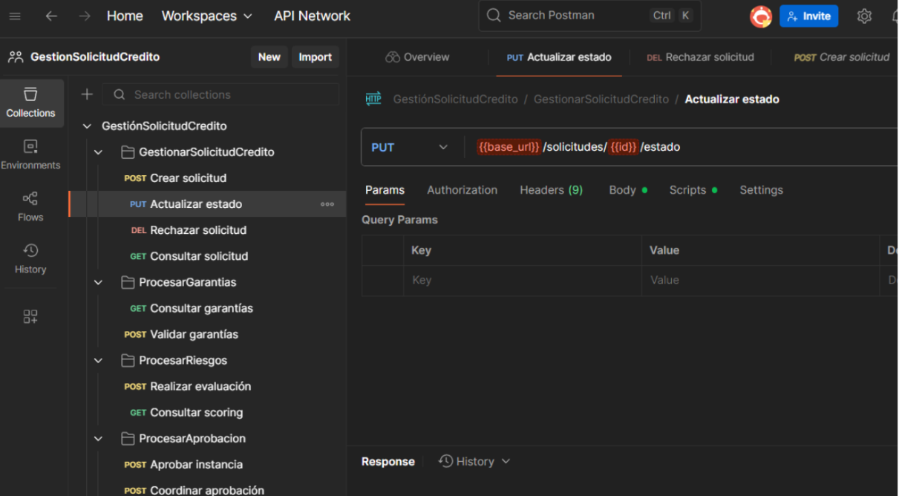
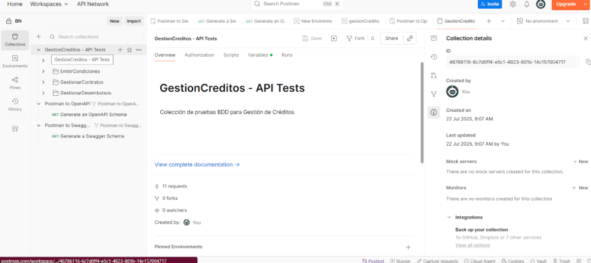
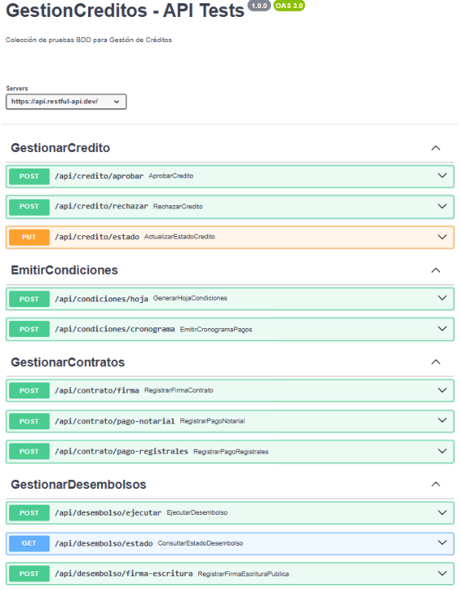
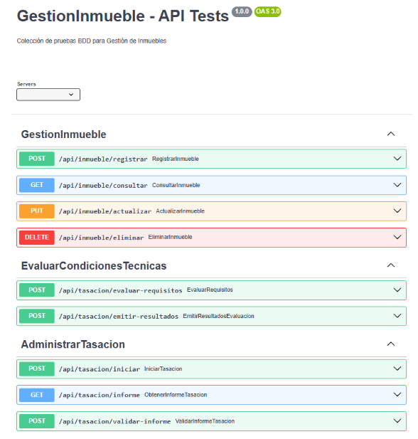
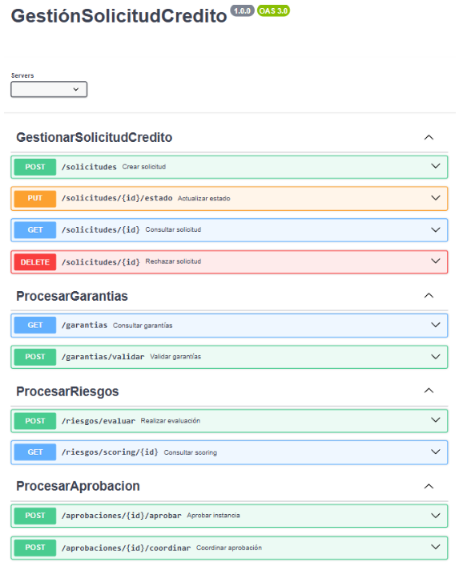

# Sub-sistemas para proceso Otorgamiento de Crédito Hipotecario

## Equipo de Trabajo

**Nombre del Equipo:** Equipo de Desarrollo BPM

**Integrantes:**
- Sumire Ramos Marko Julio
- Malcoaccha Díaz Erick Rubén
- Lizarve Mamani Johan Fabricio
- Ramos Quispe Erik Manuel
- Philco Puma Josue Samuel
- Deza Sotomayor Fernando David

---

## Propósito del Proyecto

Documentar, modelar y automatizar los procesos clave del Banco de la Nación mediante la notación **BPMN**, e implementar servicios REST que permitan una integración estructurada y estandarizada bajo el enfoque de **arquitectura orientada a servicios (SOA)** y principios de **DDD**.

## Visión General de Arquitectura: DDD
### Gestion de Créditos


### Gestión de Inmuebles


### Gestión de Solicitudes de Créditos


## BDD TESTS
Los tests BDD realizandos en postman se encuentran en la siguiente ruta:
```
src/test/java/com/hamuksoft/bankbpmsubsytems/ApiTest/
```

## **Principales Servicios REST**

Los servicios REST fueron documentados utilizando **OpenAPI 3.0**.

### Módulo: Gestión de Solicitud de Crédito  
**Propósito:** Crear y gestionar solicitudes de crédito de clientes.

**Operaciones:**
- `POST /solicitudes` – Crear nueva solicitud
- `GET /solicitudes/{id}` – Obtener estado de solicitud
- `PUT /solicitudes/{id}` – Actualizar datos
- `DELETE /solicitudes/{id}` – Rechazar solicitud

**Modelos:**
- `SolicitudCredito`: Datos personales, tipo de crédito, monto, estado.



---

### Módulo: Evaluación de Inmuebles  
**Propósito:** Registrar, tasar y validar propiedades para crédito hipotecario.

**Operaciones:**
- `POST /inmuebles` – Registrar inmueble
- `GET /inmuebles/{id}` – Obtener datos
- `PUT /inmuebles/{id}` – Actualizar información
- `DELETE /inmuebles/{id}` – Eliminar registro

**Modelos:**
- `Inmueble`: Dirección, tasación, documentos, estado de aprobación.

---

### Módulo: Gestión de Créditos  
**Propósito:** Formalizar aprobación de créditos y emitir cronogramas.

**Operaciones:**
- `POST /creditos` – Aprobar crédito
- `PUT /creditos/{id}` – Emitir hoja de condiciones
- `GET /creditos/{id}/cronograma` – Obtener cronograma de pagos

**Modelos:**
- `Credito`: Condiciones, plazos, cronograma, estado.
- `Desembolso`: Datos del pago y firma de contrato.



## **Herramienta Swagger**

1. **Gestión de Créditos**



2. **Gestión Inmueble**



3. **Gestión de Solicitud de Crédito**



**Repositorio GitHub de Servicios REST:**  
🔗 [https://github.com/Natzgun/BankBpmSubsystems.git](https://github.com/Natzgun/BankBpmSubsystems.git)